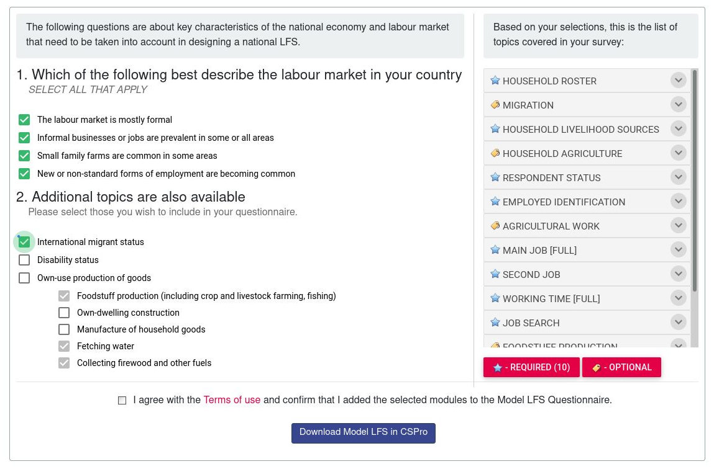

`{surveyDesigner}` is essentially a shiny interface developed as a package using the [`golem` framework](https://thinkr-open.github.io/golem/). 
The main goal is the interface is to generate contextualized questionnaires that follows predefined codebook using [XlsForm standard](https://xlsform.org/en/). Rather than starting from scratch, users can then create questionnaire based on curated questions and modules, allowing to generate standard indicators in relation with agreed-upon pre-defined analysis framework(s).

## Problem Statement: Why a Survey Designer?

For most assessment, [XlsForm](https://xlsform.org/en/) based platform such as [Kobotoolbox](https://www.kobotoolbox.org/), [OpenDataKit](https://opendatakit.org/) or [ONA](https://company.ona.io/products/ona-data/features/) have become the _de facto_ standard. Thanks to those platform constructing a questionnaire became extremely easy, but at the same time it also become very eay to replicate questionnaire design flaw and very challenging to enforce good practices (like the one described [here](https://unhcr.github.io/Integrated-framework-household-survey/Configure-forms.html)). Although questionnaire design mostly relies on common sense (Ask interesting questions first, be concise, limit answer options, use simple phrasing, ask about recent events and avoid too many open-ended questions), building a good and reliable questionnaire requires a lot of testing.

Rather than starting from scratch, it is better to leverage the existing knowledge.

### Implement Standards

Enforce Standards...

 - List of questions allowing to generate Basic & Standard Indicators  
 - Flow of questions Variable sequences  
 - List of indicators
 - Variable names & Variable modalities names standard naming conventions 
 - Skip Logic
 - Constraint

....while allowing for contextualization

 - Supplementary questions and related optional indicators
 - Adjusted Labels
 - Country Specific instructions
 
### Estimate questionnaire lenght

An important dimension in terms of data collection quality is to ensure that the final questionnaire is not long to avoid fatiguing respondents and to maintain their peak concentration without being distracted by other things, i.e __not more than 20-40 minutes__ (depending on skip logic). Optimal survey lengths are usually significantly linked the way the questions are designed and to the fact that respondents have interest in answering the survey and can trust that their data will be treated in an anonymous way. Optimal survey duration also depends on data collection mode (self-administered or interview) and both abandon rates and interview attention focus increase significantly with the number of questions includes in the questionnaire.

For both, [Education](https://www.unhcr.org/en-us/60804b214.pdf#page=7) and [Employment](https://www.unhcr.org/5ea81b954.pdf), indicators were already classified as __basic, standard & optional__. This can help defining a process where:

- Each questionnaire should systematically include all core questions to calculate basic indicators
- Depending on the quarterly data collection round, a different set of standard indicators, corresponding to one or more questions modules, can be prioritized
- After calculating the remaining potential interview time, once core & standard indicators, optional indicators can be added though supplementary and contextualisable questions
 
### Generate machine-readable codebook
 
A survey designer is not expected to be only a form-builder, but rather a codebook generator.

> A codebook describes the contents, structure, and layout of a data collection. A well-documented codebook "contains information intended to be complete and self-explanatory for each variable in a data file

## Technical Requirements for the interface

### Document data collection per anticipation and early-on

#### 1. Configure per default the correct P-code for admin unit in the country

Using [Pcode](https://www.humanitarianresponse.info/en/help/cod-pcodes-use-hrinfo) is critical to ensure that the recording of location is done in a smooth way. When designing a form, it is essential that the usage of standardised pcode is enforced for each country.

#### 2. Enforce the basic indicators that the dataset should generate:

There a multiple analysis framework that 

 1- [International Recomendations on Refugee Statistics (EGRIS)](https://www.jips.org/uploads/2019/09/EGRIS-IRRS-IntRecommendationsRefugeeStatistics-EN.pdf#page=94), most indictors there refers to SDG indicators, for which guidance in terms of specific survey questions are documented by [UN Statistics](https://unstats.un.org/sdgs/metadata/));

 2- [Protection Analysis Framework (PAF)](https://www.globalprotectioncluster.org/wp-content/uploads/Introduction-to-the-PAF.pdf);

 3- [Severity analysis (JIAF)](https://assessments.hpc.tools/sites/default/files/km/03.HPC_2021-JIAF_Guide.pdf);  

 4- [Vulnerability Analysis](https://docs.wfp.org/api/documents/WFP-0000113729/download/);  

 5- [Situation Analysis (SitAn)](https://intranet.unhcr.org/en/protection-programme/compass/COMPASS_Guidance/Guidance_6.html).

#### 3. Define which Modules shall be used & which Indicators is expected to be calculated 

#### 4. Define which Data Collection Mode will be used

 - Interview (Face-to-face or remote), 

 - Self-administered (online form)

 - Case management (embedded during regular interaction at reception centers or community centers)
    
 
#### 5. Pre-record Survey Metadata
 
Data Documentation is now covered by the [DDI Standard](https://ddialliance.org/) whcih describes data produced by surveys and other observational methods in the social, behavioral, economic, and health sciences. 
 
DDI is a free standard that can document and manage different stages in the research data life cycle, such as conceptualization, collection, processing, distribution, discovery, and archiving. Documenting data with DDI facilitates understanding, interpretation, and use -- by people, software systems, and computer networks. DDI allows to both __D__ocument, __D__iscover, and __I__nteroperate!

Describe of the study motivating the data collection: 
  - who is expected to collect the data (direct implementation, partners through a project partnership agreement, partners through a memorandum of understanding, contracted company...)
 - Sampling information: what is the population to be studied, how the sample will be drawn... 
 
    
### Create Points of control on supplementary questions

 - Check variable names – has meaning, starts with a letter, can use lowerUpper cases – meaningful, not random string. 

 - Keep existing questions as they are, name new ones. 

 - Check list choice names - meaningful, not random string. Use of lists already written instead of creating new ones (ex: YesNo, YesNoDnt)

 - Check required vs. optional – optional is discouraged unless for open text. 

 - Check relevance – make sure its correct coding for question type (select one vs. multiple). 

 - Translations at least in Spanish & English

 - Recommended use of constraints for: integers, dates, multiple choice with ‘none of the above’ ‘prefer not to say’ options. 

 - Make good use of constraint messages: “Cannot select ‘None of the above’ with other options”. 

 - Make use of ‘Hint’ space when appropriate. (i.e. read all statement above – or – listen to the answer and select appropriate match within the below list)
    
 - Clearly defined question type, based on what evidence you want to gather. 

 - Step away from a ‘case-management’ mindset and into a data mindset – the question is not used to identify a case, rather to provide evidence that supports/refutes a statement.  

 - Check/define relevance: under what conditions the question appears. Avoiding ‘not applicable’ as an answer option. 

 - Minimize/consolidate answer options –  a long list of too-specific answers will yield very small %s. Consolidate answers around bigger “themes” that would yield medium-high %s. 
    
    
  - Consider how the person would react to the question – is it too invasive? How likely are they to answer truthfully? Is the terminology difficult to understand? 
  

### Export questionaire &  validate revised questionnaire

Once initially design the questionnaire needs to be outputed as:

 - Valid XlsForm - that go through validation [here for instance](https://opendatakit.org/xlsform/)
 - In order to avoid having in parallel a word version and an encoded version of the questionnaire, a Pretty printed version of the orginial contextualized XlsForm questionnaire should be generated in either doc, html or PDF, like the one generated by [The Pretty PDF Printer--Converting XlsForm Excel files into "paper questionnaires"](https://github.com/pmaengineering/ppp)  
 
   
  

 
 - and shared automatically to the xlsform master list curator for peer reviewer and potential improvement of the orginal masterlist

As part of the  questionnaire design workflow, it is expected that the survey expert will circulate the initial draft questionnaire for review and comments. The survey export should therefore be able to upload a revised xlsform to the interface and get a validation report (comparing the contextualised version with the master for confirmation that the contextualisation is done in the scope of the acceptable standard)

  
## Limitations of existing solutions

### Kobotoolbox Question Library

Within kobotoolbox, Questions that have previously been added to a [Question Library](https://support.kobotoolbox.org/question_library.html) can be added to any other form by drag-and-dropping them from the Question Library sidebar within the formbuilder. 

   
 
This feature has the following constraints:

- Does not enforce the preservation of question sequence
- Does not allow to also include potential labels for reporting
- Does not output pretty-printed questionnaire
- Does not allow for questionnaire post-validation

### WFP Survey Designer

 [WFP Survey Designer](https://dev.surveydesigner.vam.wfp.org) seems to address the technical requirements and use case. but 
  
   

This application though has the following constraints:

- the source are closed and it is not possible to adapt it quickly for other needs
- Does not allow to also include potential labels for reporting
- Does not enforce the preservation of question sequence
- Does not output pretty-printed questionnaire
- Does not allow for questionnaire post-validation

### ILO Programme builder

 [ILO Programme builder](https://ilostat.ilo.org/resources/lfs-resources/#programme_builder) is designed to also help to the generation of contextualised questionnaire
 
 
   
This application though is not compatible with xlsform.

## Required Standard for the master xlsform

An initial example of a question bank is [here](https://github.com/unhcr-americas/surveyDesigner/blob/main/inst/XlsForm_master.xlsx)

The proposal is to follow a standard generally follows the [XLSForm format](https://xlsform.org/en/) an compatible with the one used by Kobotoolbox library, meaning a few additional columns specifying filtering capacity: 

 -  Question __blocks__ :  label has no limitations in terms of characters, but it needs to be the exact same spelling to avoid breaking the block up (’Household questions’ is different from ‘household questions’). Use a block title that makes it easy to identify the contents later on. Any row in the template sheet that doesn’t have a value in the block column will be imported as a separate question.

 -  Question __tags__ for the question or block. Each additional tag is created by adding a column tag:[your tag name] for each tag, then writing ‘1’ in each row that should use the tag. In the case of blocks, it’s enough to write ‘1’ in any of the rows in the block regardless which one. It’s enough to mark one of the questions in the block, though it doesn’t matter if several questions are tagged.

In addition the master file can include
 -  Question __groups__ in blocks. Just ensure that the ‘begin group’ line has a unique ‘name’ ID (as in all XLSForms) and that the opening (begin group) and closing (end group) are included in the block.  

  -  skip logic and validation rules within blocks: useful when importing entire blocks of questions into new form drafts without having to rebuild these advanced settings.

  -  multiple languages to question and response __labels__ with the usual XLSForm syntax (label::English (en), label::Español (es), etc.)

  -  multiple languages for labels to be used in __Report__ with [KoboloadeR](https://unhcr.github.io/koboloadeR/docs/)

